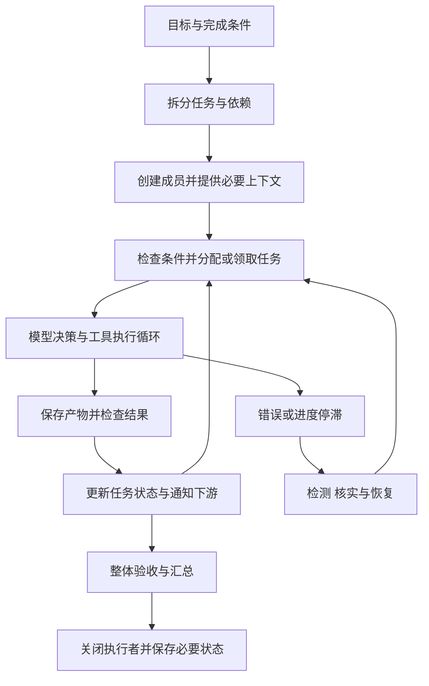

# Agent Teams 通用架构与协作机制

Agent Teams 将目标分解给多个执行实例，通过任务状态、信息交换和结果整合完成协作。它的设计核心是确定每个成员看到什么、负责什么、何时执行，以及局部结果如何形成可信的整体交付。

本文给出通用工程模型，不代表任何产品采用了全部机制。具体实现见 [Claude Code Agent Teams 方案分析与洞察](Claude%20Code%20Agent%20Teams%20方案分析与洞察.md)，延伸资料见[参考资料](参考资料.md)。

## 1. 对象与职责边界

| 对象 | 职责 | 不能混同的概念 |
| --- | --- | --- |
| 模型 | 根据上下文提出下一步行动 | 模型名称不是执行实例身份 |
| Agent 执行实例 | 维护目标、上下文及工具调用循环 | 不必对应独立 OS 进程 |
| 运行时 | 执行工具、调度、投递消息与维护状态 | 模型的意图不能替代确定性检查 |
| 任务 | 表达工作目标、归属、依赖、状态及产物 | 任务存在不表示执行者已经启动 |
| 消息 | 传递发现、问题、交接信息或控制请求 | 消息内容不自动改变任务状态 |
| 产物 | 保存代码、报告、接口约定等结果 | 产物存在不表示已经验收 |

一个模型可以支持多个实例；多个模型请求也可能只是同一实例的连续步骤。角色名称便于分工和寻址，权限必须由工具或执行环境落实。

## 2. 端到端运行链路

这是设计示意，创建任务与成员不要求按唯一顺序执行。关键在于每一步的前置条件和状态一致性。

## 3. 上下文、共享状态与信息交接

独立上下文有利于限定每个成员的关注范围，但会产生信息交接成本。共享任务表通常只保存协调信息，不能替代任务所需的背景、判断依据和接口细节。

设计队友输入时，应覆盖目标、边界、完成标准、必要背景、工具权限和相关产物位置。收到消息后，还需要运行时将其带入后续处理；存储、投递、读取与模型采取行动是不同阶段。

例如 A 修改接口，B 编写测试。任务表表达依赖关系，接口文件表达详细约定，交接消息提醒 B 哪些变化影响它的工作。无需把 A 的全部对话复制给 B，但必须让 B 能定位必要依据。

## 4. 任务分配、原子领取与依赖

分配策略决定谁适合执行任务，可以集中分配，也可以允许符合条件的成员自领。无论策略如何，领取操作都需要检查归属、状态和依赖，并以一致的方式写入新归属。

并发错误的典型路径是：A、B 都读取到未分配状态，然后分别写入自己。锁或数据库条件更新可以把“检查并写入”作为原子操作处理。仅在消息层禁止重复通知无法修复任务状态竞争。

任务 4 依赖任务 2 和任务 3 时，必须等全部前置满足后才能执行。解除阻塞只表示符合依赖条件；还要解决分配、执行者可用性和触发方式。

以下边界需要分别定义：

- 领取竞争：如何保证同一次分配只有一个成功者。
- 重新分配：谁有权变更已有 owner，旧执行是否已停止。
- 调度触发：依赖满足后由事件、轮询还是明确通知启动工作。
- 资源冲突：不同任务是否写入同一个文件或外部对象。

任务领取锁不会自动成为源文件锁，更不能替代权限控制。

## 5. 消息协议与任务状态

消息适合结果交接、请求协调和分享影响他人的发现。一个实用消息应包含相关任务、结论、产物位置和期望行动，而不只是一句“完成了”。

推荐交接顺序是产物验证、状态更新、通知下游；接收方读取当前状态后继续。若状态更新和通知不是事务，仍可能出现状态已完成而通知未送达，需要根据系统要求补充重试、扫描或幂等消费。

发送成功不等于接收成功，接收成功不等于处理完成。需要可靠协议时，应明确消息标识、关联任务、确认语义和重复处理规则，不能由一次成功返回推导出恰好一次执行。

## 6. 完成、空闲、关闭与验收

任务完成是工作状态；空闲是执行者暂时停止当前轮次；关闭是执行者结束生命周期。空闲成员可能在等待依赖，已完成一项任务的成员也可能立即开始下一项。

完成标准应提前定义，例如“覆盖三类分支并执行测试通过”，而不只是“写测试”。自动检查入口能强制执行可表达的标准，但检查入口本身不提供完整的质量判断。

负责人需要核对任务表、产物和整体目标。局部测试通过不能保证接口契约一致；整体交付往往仍需联调或交叉验证。关闭执行者前应处理尚未结束的调用和必要交接，关闭请求与关闭确认分开记录。

## 7. 失败检测与安全恢复

任务停留在执行中，只说明记录未更新。执行者可能报错、退出、卡住或等待授权，单凭任务状态无法判断存活情况。

| 信号 | 作用 | 局限 |
| --- | --- | --- |
| 运行时错误事件 | 报告可捕获的执行失败 | 运行时自身失效可能无法报告 |
| 进程退出事件 | 确认对应进程终止 | 同进程实例未必对应独立进程 |
| 心跳 | 确认最近仍能响应 | 存活不代表业务有进展 |
| 进度超时 | 发现疑似停滞 | 慢操作也可能触发，不能直接证明死亡 |

检测信号由程序产生，负责人据此决定恢复。较完整的恢复路径是：怀疑失效 → 核实执行状态 → 停止旧执行者或撤销其资格 → 检查部分产物和副作用 → 重新分配。

执行批次编号可以拒绝旧尝试的迟到结果，前提是提交入口强制检查编号。如果旧执行者仍能直接写共享文件，编号无法阻挡该写入；需要额外停止或隔离。外部操作重复执行还要处理幂等问题。

## 8. 设计取舍

团队适用于能明确分工且整合成本可控的问题。增加成员带来的并行收益，要与重复背景、通信、等待和验收成本一起考虑。动态委派和固定流程的比较可参见资料 [G1](参考资料.md#g1)。

| 选择 | 收益 | 代价 |
| --- | --- | --- |
| 集中分配 | 归属和全局优先级清楚 | 负责人可能成为瓶颈 |
| 自主领取 | 容易利用空闲成员 | 需要一致性和匹配规则 |
| 共享工作目录 | 结果立即可见 | 文件覆盖与部分结果干扰 |
| 隔离工作目录 | 减少写入冲突 | 需要合并和传递变化 |
| 强制验收 | 可阻止部分错误完成 | 规则成本及误阻塞风险 |
| 自动恢复 | 减少人工接续 | 要处理旧执行、重复副作用和迟到结果 |

任务协调、上下文隔离、资源隔离和故障恢复是相互配合的能力。评价一个方案时，应逐项确认其保证范围，再判断它是否满足具体工作负载。
