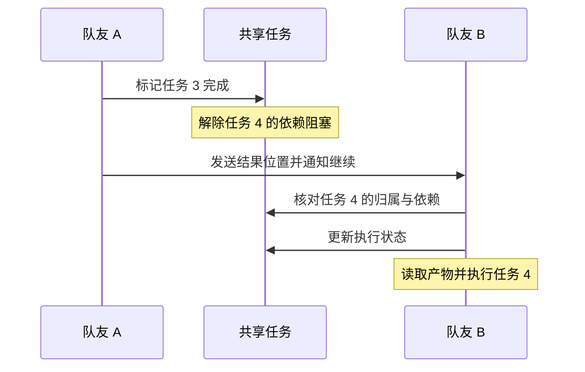

# Claude Code Agent Teams 方案分析与洞察

Claude Code Agent Teams 将负责人、独立上下文的队友、共享任务和消息通信组合成协作能力。分析重点是任务状态如何连接成员执行，以及这些机制在哪些位置仍需要显式协调。

依据：公开产品文档，核对日期 2026-09-14。官方页面持续更新，包含多个版本的行为；版本限定结论不应推广到所有安装版本。本文分析产品公开语义，不声称取得或还原内部源码。来源编号集中见[参考资料](参考资料.md)。

## 1. 架构与创建

```text
负责人：拆分目标、安排成员、汇总结果
    ├─ 队友 A：独立上下文与工具执行
    ├─ 队友 B：独立上下文与工具执行
    ├─ 共享任务：状态、归属、依赖
    └─ 邮箱：成员之间的信息传递
```

官方区分 v2.1.178 前后的团队设置方式：新版不再要求旧式 TeamCreate/TeamDelete 设置步骤。队友启动与任务记录是不同概念。[C1](参考资料.md#c1)

因此，`owner = B` 只能表达归属，不能据此断言 B 已创建或已开始执行。团队创建流程也不宜固化成“先建立所有任务，再建立所有队友”的唯一顺序。

从工具职责看，可以用以下链路理解一次工作交接：`TaskCreate` 表达工作项，`TaskUpdate` 修改归属或状态，`Agent` 启动执行实例，`SendMessage` 传递信息，`TaskGet` 读取当前任务。它是接口职责的组合，不限定唯一调用顺序。[C3](参考资料.md#c3)

## 2. 任务协调：分配、竞争和依赖

官方描述负责人分配与队友自领两种路径，自领面向未分配、未阻塞的工作；领取使用文件锁防止竞争，前置完成会解除后续依赖阻塞。[C1](参考资料.md#c1)

从机制上需要分开看四个条件：

| 条件 | 含义 | 不足以推出的结论 |
| --- | --- | --- |
| 任务存在 | 有可追踪工作项 | 执行者已经启动 |
| 有 owner | 已表达归属 | 名称自动限制工具或技能 |
| 依赖满足 | 可以进入后续调度 | 空闲成员必然立即醒来 |
| 领取成功 | 竞争中获得任务 | 任意代码文件都被保护 |

文件锁的产品保证与“已分配任务能否重新分配”不同。没有具体工具规则或源码证据，不能把领取互斥扩展成所有权不可变、任意更新均受同一锁保护或完善的崩溃恢复。

## 3. 解锁到执行：显式交接的价值

设任务 4 由 B 执行且依赖 A 的任务 3。依赖完成和调度启动分别回答“可不可以做”和“现在谁来做”。

公开说明没有明确保证所有情况下依赖解除都会唤醒已经空闲的指定成员。因此可采用以下协作约定：



图中的通知步骤是建议明确配置的协作行为，不是宣称运行时默认按该顺序调度。[C1](参考资料.md#c1)

## 4. 消息、上下文和共享产物

队友上下文独立，可以直接互发消息。任务工具和 SendMessage 分别承载状态操作与通信。[C1](参考资料.md#c1)、[C3](参考资料.md#c3)

一个有效交接可以表达：“任务 3 已完成，接口定义位于指定文件；错误响应有变化，请核对任务 4 后继续。”任务记录管理归属和依赖，文件保存具体结果，消息提示相关行动。

架构洞察：共享状态解决可见性，消息解决信息传递，后续模型轮次解决理解与执行。这三者不能合并成一个“自动同步”的概念。把任务标为完成不等于发送消息，发送成功也不等于对方已完成处理。

对于消息确认、重试或恰好一次语义，需要单独的证据；工具成功返回不能自动提供这些保证。对某个队友追加要求，也不应假设其他成员因此拥有相同上下文。

## 5. 生命周期与质量控制

任务完成、队友空闲和队友关闭必须分别判断。官方支持关闭请求及队友响应。[C1](参考资料.md#c1)

`TaskCompleted` 和 `TeammateIdle` Hook 提供完成任务前、进入空闲前的检查入口；命令 Hook 返回退出码 2 可阻止对应动作并反馈。[C2](参考资料.md#c2)

这使可表达的验收标准能够成为约束，例如检查测试是否通过。不过规则需要自行定义，启用团队不等于自动具备完整验收。禁止所有未完成团队成员空闲也不合理，因为成员可能正在等待依赖。

推荐的负责人收尾策略是检查产物与任务一致性、进行整体验收、安排必要修正，再关闭不再需要的成员。它是工作组织建议，不是固定内置状态机。

## 6. 故障边界

官方明确说明因 API 错误结束一轮时会向负责人报告失败，也提醒任务状态可能滞后。[C1](参考资料.md#c1)

这支持“存在部分运行时失败通知”的判断，不支持“所有失效都自动检测并回收任务”的判断。应区别：

- 工具或模型请求失败，但运行时还能报告。
- 执行实例或进程突然退出。
- 程序还在，却长期没有有效进展。
- 负责人所在的运行环境也一起退出。

完整的心跳、租约、卡死检测、自动重分配和旧执行隔离协议，在本文证据范围内不能确认。故障恢复设计详见[通用机制](Agent%20Teams%20通用架构与协作机制.md)，不能将这些设计选项当作 Claude Code 默认能力。

## 7. 存储与会话边界

官方将团队配置、邮箱和任务存储关联到本地会话，并区分团队目录清理与任务记录保留；恢复主会话不等于恢复原有 in-process 队友。[C1](参考资料.md#c1)

```text
~/.claude/teams/<团队>/config.json
~/.claude/teams/<团队>/inboxes/<成员>.json
~/.claude/tasks/<团队>/
```

`<团队>`、`<成员>` 表示实际运行时标识，不是字面目录名。任务中的 `blocks`、`blockedBy` 表达依赖关系，`pending`、`in_progress`、`completed` 表达任务状态；阻塞条件和成员是否空闲应独立解释。目录中存在文件，并不足以证明其更新事务或消费算法。[C1](参考资料.md#c1)、[C3](参考资料.md#c3)

架构含义是：协调记录与执行者生命周期不同。排查残留执行中任务时，需要核对执行者是否仍存在，而不是只看持久化记录。界面显示、目录存在、任务状态也应作为不同证据处理。

## 8. 方案定位与关键洞察

Claude Code 的公开机制强调成员协作与任务协调。对复杂可靠性要求，仍应逐项查明支持范围。

| 机制边界 | 设计洞察 |
| --- | --- |
| 上下文与共享状态 | 共享任务不能替代明确的任务背景和结果交接 |
| 依赖与调度 | 解除阻塞不是执行触发的完整证明 |
| 领取锁与权限 | 互斥领取、重新分配、工具限制属于不同约束 |
| 任务与文件 | 两项不同任务仍可能覆盖同一个文件 |
| 完成与验收 | 状态声明需要与可检查产物相结合 |
| 失败通知与恢复 | 报告一次错误不等于提供安全重试整个任务的协议 |
| 持久化与存活 | 任务还在不表示原执行者还在 |

以上边界能帮助判断何时需要显式消息、清楚的完成标准或额外隔离，而无需推测闭源实现的内部算法。
