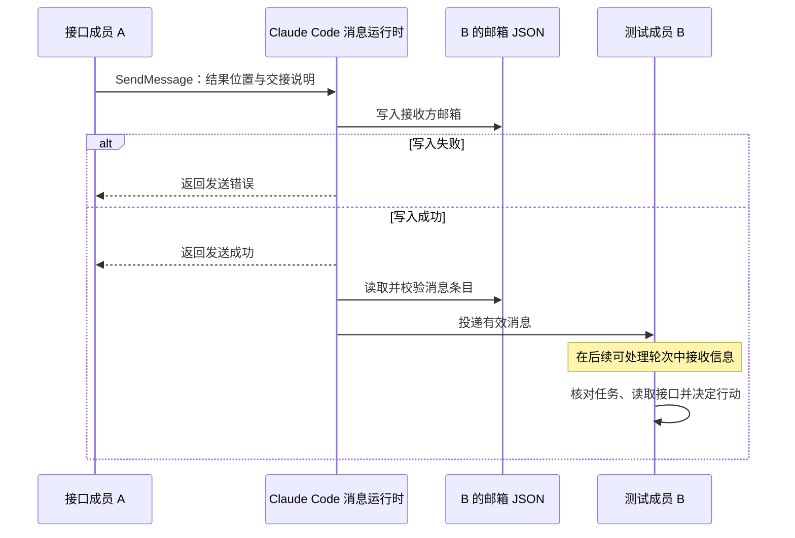

# Claude Code Agent Teams 方案分析与洞察

假设要给一个项目增加登录功能：一个 Agent 实现接口，另一个 Agent 编写集成测试，负责人负责拆分工作和检查最终结果。接口没写好时，测试成员需要等待；接口发生变化时，它需要及时知道；某个成员中途失败时，负责人还得判断工作停在了哪里。

Claude Code Agent Teams 就是在这样的协作过程中发挥作用的。它让多个成员各自工作，再用共享任务和消息把这些工作连接起来。要理解这套方案，可以沿着一项工作从分配到完成的过程，看清楚三个问题：成员如何开始工作，信息如何传给别人，以及系统怎样记录和结束这次协作。

本文依据官方文档和 Claude Code 2.1.198 的版本行为观察整理。文档核对日期为 2026-09-14，各出处收录在[参考资料](参考资料.md)。涉及新版行为时会标明版本；JSON 示例经过简化，用于解释字段关系。

## 团队是怎样建立起来的

团队中有一个负责人，以及由它创建的队友。负责人也是一个 Agent 会话：它理解目标、安排分工，再通过工具把安排落实为成员和任务。队友则各自维护上下文，调用模型和工具完成工作。

这里所说的“运行时”，就是负责执行这些工具、维护状态和投递消息的 Claude Code 程序。模型可以决定“把测试交给 reviewer”，而实际创建 reviewer、保存归属、传递指令的动作，都需要运行时完成。

Agent Teams 需要启用 `CLAUDE_CODE_EXPERIMENTAL_AGENT_TEAMS=1`。官方区分了 v2.1.178 前后的团队设置方式：旧教程中的 TeamCreate、TeamDelete 已不再是新版的设置步骤。创建结果还与是否处于交互模式、Agent 工具的调用形态有关，因此不能仅凭界面出现一个子 Agent，就认定它是团队成员。[C1](参考资料.md#c1)

从工具上看，建立一个团队和安排工作涉及几个独立动作：

| 工具 | 在协作中做什么 |
| --- | --- |
| `Agent` | 启动命名队友等执行实例 |
| `TaskCreate` | 建立任务，描述目标和要求 |
| `TaskUpdate` | 更新任务归属或执行状态 |
| `TaskGet` / `TaskList` | 查看某项任务或整个任务列表 |
| `SendMessage` | 把信息发送给其他成员 |

这些职责在 2.1.198 的工具行为中可以分别观察到。[E1](参考资料.md#e1) 它们不要求固定的先后顺序：负责人可以先建任务，再启动成员；也可以让已有成员接手后来增加的工作。但把任务的 `owner` 写成 reviewer，只完成了分配，reviewer 是否存在、是否开始执行，还需要分别确认。

队友启动时会得到启动提示和项目背景，但不会自动继承负责人此前的完整聊天。[C1](参考资料.md#c1) 所以，在登录功能的例子中，只说“你负责测试”往往不够。负责人还应交代接口位置、需要覆盖的情况、哪些代码可以修改，以及怎样才算完成。

成员之间的上下文虽然独立，执行环境却未必完全隔离。in-process 后端在同一宿主中管理队友，split-pane 模式则提供独立窗格。是否共享代码目录、权限和进程资源，要结合具体后端与配置判断。

## 团队建立后，哪些信息保存在本地

当成员开始工作，Claude Code 需要知道团队里有谁、任务归谁，以及消息应该交给谁。这些信息有各自的保存位置。下面的结构结合了官方说明和 2.1.198 的文件观察，其中尖括号代表实际的团队、成员或会话标识：[C1](参考资料.md#c1)、[E1](参考资料.md#e1)

```text
~/.claude/
├── teams/<团队>/
│   ├── config.json
│   └── inboxes/
│       ├── team-lead.json
│       └── <成员>.json
├── tasks/<团队>/
│   ├── .lock
│   ├── .highwatermark
│   └── <任务ID>.json
└── projects/<项目编码>/
    ├── <会话ID>.jsonl
    └── <会话ID>/subagents/
        └── agent-<标识>.jsonl
```

读这份目录时，可以先把文件分成四组：成员配置、任务记录、收件箱和会话记录。

| 文件 | 主要用途 |
| --- | --- |
| `teams/<团队>/config.json` | 保存团队成员的身份、会话关联和运行后端等信息 |
| `tasks/<团队>/<任务ID>.json` | 保存单个任务的说明、归属、状态和依赖 |
| `teams/<团队>/inboxes/<成员>.json` | 保存发给这个成员的消息，由运行时读取和投递 |
| `inboxes/team-lead.json` | 2.1.198 中观察到的负责人邮箱；工具使用的寻址别名应以实际接口为准 |
| `<会话ID>.jsonl` | 记录主会话的消息和工具事件，供回看与诊断 |
| `subagents/agent-<标识>.jsonl` | 记录队友会话中的事件，包括工具调用与结果 |

`projects/` 下的命名形式来自 2.1.198 in-process 观察，不是所有后端都必须遵守的格式。会话记录能帮助还原发生过什么，但消息通信依靠邮箱机制，不能把转录文件理解成队友相互扫描的共享聊天记录。

任务目录还有两个辅助文件。`.lock` 与任务存储的互斥访问有关，官方也明确说明领取任务会使用文件锁。不过，文件存在并不能说明具体锁原语、所有受保护的操作或崩溃后的处理方式。`.highwatermark` 同样确认存在；从名称推测，它与任务编号的上界管理有关，但精确用途、更新时机以及是否防止编号复用，还缺少足够证据。[E1](参考资料.md#e1)

### config.json 让运行时知道成员是谁

下面是按已知字段构造的简化示例，成员标识是示意值：

```json
{
  "name": "session-example",
  "members": [
    {
      "name": "team-lead",
      "agentId": "team-lead@session-example",
      "agentType": "team-lead",
      "backendType": "in-process"
    },
    {
      "name": "reviewer",
      "agentId": "reviewer@session-example",
      "agentType": "general-purpose",
      "model": "sonnet",
      "backendType": "in-process"
    }
  ]
}
```

`name` 是便于使用的成员名称，`agentId` 标识具体成员，`agentType` 表示角色类型，`backendType` 表示运行后端。`model` 记录模型选择；如果使用自定义模型服务，别名最终映射到哪个后端模型，还要以服务配置为准。[E1](参考资料.md#e1)

这份配置随着成员变化由运行时维护，不能当成手工编写后就永久生效的团队模板。它告诉系统“这个成员是谁”，成员要做什么则主要由任务和指令表达。

## 一项任务怎样被分配和执行

回到登录功能的例子。把接口实现记为任务 3，把集成测试记为任务 4，并交给 reviewer。任务 4 的记录可以用下面的示意 JSON 表达：

```json
{
  "id": "4",
  "subject": "执行接口集成测试",
  "description": "依据任务 3 的接口结果执行测试并报告验证情况",
  "status": "pending",
  "owner": "reviewer",
  "blocks": [],
  "blockedBy": ["3"]
}
```

标题和说明交代工作内容，`owner` 表达归属，`status` 表达当前状态。任务还依赖接口实现，因此 `blockedBy` 包含任务 3；`blocks` 则用来表达它阻塞了哪些后续任务。这些字段结合了任务工具语义和版本观察，示例本身不是实际任务原文。[C3](参考资料.md#c3)、[E1](参考资料.md#e1)

有依赖的任务可以继续保持 `pending`，阻塞条件由依赖关系表达。没有分配的任务也可以缺少 `owner`。实际使用时，应通过任务工具维护这些关系，避免手工编辑文件导致状态不一致。

负责人可以直接分配任务，队友也可以在完成工作后寻找未分配、未阻塞的任务。多个成员同时尝试领取同一项工作时，文件锁用于避免竞争。[C1](参考资料.md#c1)

这把锁处理的是领取过程。比如两个成员都看到任务未分配，运行时需要协调它们的领取操作；至于负责人能否重新分配、其他成员能否修改 owner，则属于另一组规则。两个不同任务如果都修改同一个源文件，也不能指望任务领取锁替它们解决覆盖问题。

角色名称也有类似区别。把成员叫作 reviewer，有助于说明分工，但不会仅凭名字限制它的工具能力。任务匹配、工具权限和资源保护，需要分别考虑。

任务工具的可用性还与版本有关。v2.1.268 起，官方列出了随模型和运行环境变化的规则；没有 Task 工具的成员通过消息协调。因此，任务表是理解这条协作路径的基础，但不能假定所有版本和会话都默认提供同样的工具集。[C3](参考资料.md#c3)

## 接口完成以后，测试成员怎样知道

任务 3 完成后，系统会解除任务 4 的依赖阻塞。如果任务 4 还依赖任务 2，就必须等两个前置都满足。[C1](参考资料.md#c1)

但依赖解除只回答了“现在可以做了吗”。如果 reviewer 已经空闲，仍然需要知道“接下来该继续这项工作”。公开说明没有完整保证，解除依赖一定会唤醒已经空闲、且被指定负责这项任务的成员。队友自主领取未分配任务的描述，也不能直接用来解释这个已分配的场景。

因此，可以在分工时约定：接口成员更新任务状态后，给 reviewer 发一条交接消息。例如：

> 任务 3 已完成，接口位于 src/auth/login.ts。失败响应不再返回 token，请核对任务 4 的依赖状态，再开始集成测试。

这条消息同时给出了完成情况、产物位置和需要注意的变化。reviewer 收到后可以读取最新任务状态和接口文件，再开始执行。通知也可以由负责人发送，具体由谁负责应在工作安排中明确。

这是一个协作约定。它把依赖解除和后续执行连接起来，并不表示 Claude Code 内部一定有一个按此顺序运行的调度器。

## 一条消息怎样从 A 到达 B

负责人可以联系队友，队友可以回报负责人，也可以直接向其他队友发消息。因此，接口成员能够直接通知测试成员，不必每次都经负责人转述。[C1](参考资料.md#c1)

成员通过 `SendMessage` 表达收件人和内容，后面的文件写入与投递由运行时处理。官方将邮箱描述为按接收者划分的 JSON 文件：写入成功后才报告发送成功，读取时会校验条目，再投递有效消息。[C1](参考资料.md#c1)



图中区分的是发送、存储、投递和处理几个阶段，不对应已确认的内部函数或线程。接收方模型不需要自己反复调用 Read 检查邮箱，运行时会负责投递。至于底层结合了轮询、文件监听还是内存通知，以及具体检查间隔，公开依据没有给出完整答案。

这也解释了为什么“发送成功”还不能当作“对方做完了”。2.1.198 中，向主会话发送消息的成功结果表示消息排入下一轮；接收方什么时候处理、处理后采取什么行动，是后续步骤。[E1](参考资料.md#e1)

### 邮箱文件能说明什么

收件箱按接收方划分，A 发给 B 的消息对应 B 的邮箱。2.1.198 的文件观察确认了邮箱存在，并采样到内容为 `[]` 的空邮箱。不过，空数组只说明那个时刻没有可见条目，无法确定消息处理后究竟是删除、标记已读，还是采用其他消费方式。[E1](参考资料.md#e1)

消息格式也会影响投递。官方当前说明会剔除格式不正确的条目，继续处理有效消息；在 v2.1.207 之前，坏条目可能阻断该邮箱的投递。[C1](参考资料.md#c1) 因而，理解通信时既要看工具返回，也要考虑邮箱写入和格式校验是否成功。

现有依据还不足以确定完整的邮箱条目字段、处理确认和故障重送协议，所以这里不提供一个看似真实的消息 JSON。能确认的是文件邮箱和自动投递这一层，不能进一步推出恰好一次处理等保证。

### 哪些消息需要成员主动发送

接口变更、澄清问题和结果交接，都需要成员组织内容并发送。除此之外，运行时还会把一些执行事件报告给负责人：队友结束一轮并空闲时会通知负责人；API 错误导致该轮结束时也会报告失败。[C1](参考资料.md#c1)

这些通知用途不同。收到空闲通知，负责人知道该成员暂时停下了；收到接口交接消息，测试成员才获得开始测试所需的具体信息。任务依赖解除也不能自动代替这条业务消息。不同类型通知的完整内部格式仍需分别核实。

如果用户直接给测试成员追加了要求，也应让它把影响其他人的部分明确转告出去。独立上下文意味着其他成员未必同步获得整段新输入；需要共享的是影响协作的约束和决定。

## 把任务状态、消息和代码放在一起看

现在可以把登录功能的交接过程串起来：接口成员先修改项目代码，验证结果，再通过 TaskUpdate 完成任务 3。任务记录随之变化，测试任务的依赖阻塞被解除。接着，接口成员通过 SendMessage 把产物位置和接口变化发给 reviewer。

reviewer 处理消息时查看任务 4 的最新归属和依赖，再读取接口文件。如果条件满足，就更新执行状态并开展测试。最后，负责人把两边的产物和验证结果放在一起检查，而不只是查看任务表里的 completed。

这个过程涉及三处不同的数据：代码文件保存实现，任务文件保存工作状态，邮箱传递交接信息。把它们分开，能更容易理解协作中出现的不一致。

例如，任务 3 已标记完成，但交接消息发送失败，测试成员可能还没有得到提醒。反过来，如果先发“完成了”再更新状态，reviewer 处理消息时可能仍然看到任务被阻塞。接收方检查最新状态能减少误判；补发通知或核查滞留任务，则需要在工作流里明确安排。

同样，消息中有结果摘要不意味着代码一定正确。接口和测试各自通过局部检查以后，还可能存在字段名、错误码或调用约定不一致的问题，最终仍需要整体检查。

## 工作完成后，队友为什么还会留着

完成任务、进入空闲和关闭会话是三个不同动作。reviewer 可以完成任务 4 后继续下一项工作，也可以因为暂时没有可执行任务而空闲。负责人看到 idle 时，需要结合任务表和交付结果判断进展。

要让完成标准更可靠，可以在任务中提前写明要求，再通过 Hook 检查。`TaskCompleted` 在任务准备完成时提供检查入口，`TeammateIdle` 在成员准备空闲时提供检查入口；命令 Hook 返回退出码 2，可以阻止相应动作并反馈。[C2](参考资料.md#c2)

例如，集成测试任务可以要求提供测试执行结果，缺少结果时拒绝完成。不过检查规则应允许合理等待：测试成员正在等接口时，不能仅因为团队仍有待办就一直禁止它空闲。Hook 提供了执行规则的位置，规则本身需要围绕实际完成标准设计。

当负责人确认不再需要这个队友时，可以发出关闭请求。成员能够同意，也可以说明理由并拒绝；正在执行的请求或工具还可能影响退出时机。[C1](参考资料.md#c1) 因此，关闭请求发出以后，还要区分请求已送达和成员已经结束。

### 会话结束后，文件为什么不全都消失

团队配置和邮箱用于维持当前协作，会话结束后团队目录会清理。任务记录则可以保留，用于后续接续。在 2.1.198 的观察中，退出后团队目录已经消失，但任务目录和一个 pending 任务仍然存在。[C1](参考资料.md#c1)、[E1](参考资料.md#e1)

这能解释两种常见现象：退出以后找不到原来的 config.json，并不与运行期间存在该文件矛盾；重新打开后看到任务还在，也不表示原来的队友已经恢复。恢复主会话并不会自动恢复原有 in-process 队友。[C1](参考资料.md#c1)

还要把任务目录的保留与单个文件的保留分开。某个完成任务由工具确认过，但采样时没有对应 JSON，并不足以推出所有完成任务都采用相同清理策略。界面里隐藏的成员行也不等于成员已退出，判断应结合实际运行状态和版本行为。

## 队友中途出问题，负责人怎样处理

最容易造成误解的情况是：任务一直显示 `in_progress`，但执行它的成员已经没有回应。这个状态只说明任务记录还没有更新，原因可能是请求失败、长命令未结束、等待权限，也可能是执行者退出或卡住。

Claude Code 已公开的行为包括 API 失败通知，但这并不能覆盖所有故障。如果整个运行程序退出，通知机制本身也可能停止；如果程序还在但没有进展，又需要进一步检查才能区分慢操作和卡死。[C1](参考资料.md#c1)

排查时，几种证据需要配合使用：错误通知说明发生过已捕获的失败；任务表说明工作记录的状态；会话转录帮助查看最后执行到哪一步。邮箱文件仍在，只能证明磁盘对象尚未清理，不能证明接收者仍能处理消息。

负责人接手这样的任务时，合理的顺序是先核对成员状态和已有产物，再决定让原成员继续还是换人。换人之前还要考虑旧执行者是否可能恢复：如果它仍能写入同一批文件，新旧成员就可能同时工作。

完整的心跳、租约、卡死检测和安全自动重分配协议，在现有证据中尚不能确认。通用的执行批次、幂等和隔离方案，可以用于分析这类恢复问题，具体见[通用架构与协作机制](Agent%20Teams%20通用架构与协作机制.md)；它们不能直接当作 Claude Code 已经实现的内部算法。

## 从这套协作方式看设计取舍

Claude Code 把成员、任务、消息和会话记录分别组织起来，给协作提供了清楚的落点。成员配置让运行时找到执行者，任务文件记录工作关系，邮箱传递需要关注的信息，转录留下可供诊断的执行记录。分工明确时，这些机制能把多个独立工作过程连接起来。

也正因为它们分别维护，使用和分析时需要关注相邻步骤之间的交接：状态已经更新，消息是否送达；消息已经送达，成员是否处理；成员已经停下，结果是否验收；记录还在，执行者是否存活。这些问题决定了何处需要补充通知、检查或恢复安排。

角色名称、任务锁和上下文隔离也各有作用范围。名称帮助组织分工，任务锁协调竞争领取，独立上下文让成员各自处理问题；工具权限和共享文件保护仍需按实际配置判断。把这些关系放回完整工作过程里，才能看清 Agent Teams 已提供的能力，以及具体项目还需要怎样组织协作。
