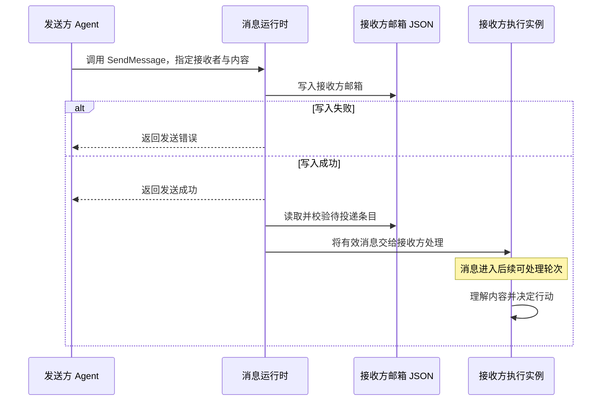

# Claude Code Agent Teams 方案分析与洞察

Claude Code Agent Teams 的核心是：成员使用独立上下文执行工作，通过共享任务记录协调归属与依赖，通过邮箱传递信息。理解它需要同时看执行实例、磁盘状态和消息进入后续模型轮次的过程。

本文串联创建、文件、任务、通信、验收和故障处理。依据包括官方公开说明与 2.1.198 版本行为观察，来源集中在[参考资料](参考资料.md)。公开文档核对日期为 2026-09-14；带版本的结论按版本理解，示意 JSON 不作为稳定接口契约。

## 1. 整体架构：四类组件和两条协调通道

| 组件 | 具体职责 | 与其他组件的关系 |
| --- | --- | --- |
| 负责人 | 分解目标、创建成员、安排任务、整合结果 | 也是一个模型驱动的会话，由运行时执行工具 |
| 队友 | 在自己的上下文中调用模型和工具 | 通过成员身份寻址，通过任务记录获知工作 |
| 任务存储 | 表达任务目标、owner、状态和依赖 | 协调“谁做、能否做、做到哪一步” |
| 邮箱与投递机制 | 把信息从发送方传给接收方 | 支撑交接、澄清及控制请求 |

“任务状态通道”与“消息通道”分别存在：A 把任务写为 completed，不等于给 B 发了一条消息；B 收到消息，也不等于任务状态已经更新。这是解释依赖等待、空闲和收尾时最重要的边界。[C1](参考资料.md#c1)、[E1](参考资料.md#e1)

执行实例不必一一对应 OS 进程。in-process 后端在同一宿主中管理队友；split-pane 模式把队友展示在独立窗格中。不能仅凭“上下文独立”断言代码目录、文件权限和进程资源都隔离。

## 2. 创建与上下文：从启用到队友执行

Agent Teams 需要启用 `CLAUDE_CODE_EXPERIMENTAL_AGENT_TEAMS=1`。官方将 v2.1.178 前后的行为分开说明：旧教程中的 TeamCreate/TeamDelete 不再是新版必需设置步骤。当前创建还受交互模式、Agent 调用形态等条件影响，普通子 Agent 与团队成员不能仅靠界面外观区分。[C1](参考资料.md#c1)

下面是 2.1.198 可观察的工具职责，不是唯一顺序：[E1](参考资料.md#e1)

| 工具 | 作用 | 关键边界 |
| --- | --- | --- |
| `TaskCreate` | 建立工作项 | 不创建成员 |
| `TaskUpdate` | 修改 owner 或任务状态 | owner 字符串本身不启动执行者 |
| `Agent` | 启动命名队友等执行实例 | 具体身份与后端由运行环境决定 |
| `SendMessage` | 发送信息 | 不替代 TaskUpdate |
| `TaskGet` / `TaskList` | 查看工作状态 | 读取不等于领取或开始执行 |

任务可以先创建再分配，也可以在已有成员工作时继续增加。应判断成员是否存在、任务是否归属它、依赖是否满足、是否已有触发它行动的信息，而不是只看一个字段。

队友启动时拥有自己的上下文，接收启动提示和项目背景；负责人之前的完整聊天不会自动成为队友上下文。[C1](参考资料.md#c1) 因此，分工指令需要提供目标、完成标准、约束和必要文件位置。“你负责后端”既不充分描述工作，也不是权限限制。

## 3. 本地文件：保存什么，由谁使用

下面将官方公布的结构与 2.1.198 文件观察合并展示。`<团队>`、`<成员>`、`<任务ID>` 都是占位符，不是固定名字。[C1](参考资料.md#c1)、[E1](参考资料.md#e1)

```text
~/.claude/
├── teams/<团队>/
│   ├── config.json
│   └── inboxes/
│       ├── team-lead.json
│       └── <成员>.json
├── tasks/<团队>/
│   ├── .lock
│   ├── .highwatermark
│   └── <任务ID>.json
└── projects/<项目编码>/
    ├── <会话ID>.jsonl
    └── <会话ID>/subagents/
        └── agent-<标识>.jsonl
```

其中 projects 下的形式是版本观察，不是所有后端都必须采用的统一命名协议。

| 文件 | 保存内容与职责 | 读写与生命周期 | 证据范围 |
| --- | --- | --- | --- |
| `teams/<团队>/config.json` | 团队与成员运行信息，如名称、身份、会话关联、后端类型 | 运行时随成员变化维护；可用于发现成员，结束后团队目录会清理 | 官方说明及 2.1.198 观察 |
| `inboxes/<成员>.json` | 该成员的收件箱 | 发送侧通过运行时写入；接收侧运行时读取并投递 | 官方文件邮箱说明；2.1.198 确认文件存在 |
| `inboxes/team-lead.json` | 负责人对应的邮箱文件 | 属于成员通信的同一存储体系 | 2.1.198 文件观察；具体工具寻址别名不能只按文件名猜 |
| `tasks/<团队>/<任务ID>.json` | 单个任务的标题、说明、状态及依赖等 | 任务工具经运行时创建和更新；任务目录可比执行会话存活更久 | 2.1.198 JSON 与工具结果 |
| `.lock` | 任务存储目录中的锁相关辅助文件 | 配合互斥访问；具体原语、覆盖范围和失效恢复不能仅由文件名确定 | 文件存在已观察；官方独立说明领取使用文件锁 |
| `.highwatermark` | 任务编号管理的辅助标记，按名称推断与已分配编号上界有关 | 精确更新时机、是否防止编号复用尚无充分证据 | 存在已观察，职责解释属于推断 |
| `<会话ID>.jsonl` | 主会话的消息与工具事件记录 | 会话运行中形成，用于回看执行与诊断 | 2.1.198 观察；不是任务表或邮箱 |
| `subagents/agent-<标识>.jsonl` | 队友的会话事件记录 | 记录该执行实例的工具调用与结果 | 2.1.198 in-process 观察，不推广到所有后端 |

不能把 config.json 当作可手工编写的团队模板：它包含运行时状态，可能被后续更新覆盖。也不能把“会话转录里有消息”当成“Agent 靠扫描所有人的转录进行通信”。转录是记录，邮箱是通信存储，职责不同。

### 3.1 config.json：成员身份和运行关联

以下是按已知字段构造的简化示例，省略实际会话标识和可选字段，值为示意：[E1](参考资料.md#e1)

```json
{
  "name": "session-example",
  "members": [
    {
      "name": "team-lead",
      "agentId": "team-lead@session-example",
      "agentType": "team-lead",
      "backendType": "in-process"
    },
    {
      "name": "reviewer",
      "agentId": "reviewer@session-example",
      "agentType": "general-purpose",
      "model": "sonnet",
      "backendType": "in-process"
    }
  ]
}
```

`name` 用于理解和寻址成员，`agentId` 表达具体身份，`agentType` 表达角色类型，`backendType` 表达运行后端。模型别名不保证自定义服务端最终映射到同名模型。成员配置既不是任务清单，也不是完整上下文。

### 3.2 任务 JSON：状态、归属与依赖

以下是用于解释字段的合成例子，不是某次真实运行的任务原文：

```json
{
  "id": "4",
  "subject": "执行接口集成测试",
  "description": "依据任务 3 的接口结果执行测试并报告验证情况",
  "status": "pending",
  "owner": "reviewer",
  "blocks": [],
  "blockedBy": ["3"]
}
```

- `subject` 与 `description` 表达目标和工作说明。
- `status` 表达待办、执行中或完成；有依赖阻塞的任务可以仍是 pending，不必另有 blocked 状态。
- `owner` 表达分配对象；未分配任务可没有该字段。
- `blockedBy` 表达前置，`blocks` 表达其阻塞的后续任务。

字段解释结合任务工具语义与版本观察；不要直接手工编辑文件来替代工具维护依赖关系。完成任务后，也不能假设所有任务 JSON 都会永久保留。[C3](参考资料.md#c3)、[E1](参考资料.md#e1)

## 4. 分配、领取和依赖如何协同

官方支持负责人分配，也描述了队友完成任务后寻找未分配、未阻塞任务的路径。领取使用文件锁避免竞争。[C1](参考资料.md#c1)

锁解决的是同一时刻竞争领取的一致性问题。它不能单独证明：其他成员绝对不能改 owner、负责人不能重新分配、所有状态修改使用同一个事务，或两个不同任务写同一文件会受到保护。

依赖有两层：任务 4 的全部前置完成后，系统解除其阻塞；解除以后，仍需执行者开始处理。对于已经空闲且被指定负责 4 的 B，公开依据没有完整保证“解锁即自动唤醒”。自领未分配任务的说明，也不能自动覆盖这种已分配任务情形。

因此，一个明确的交接约定是：A 完成 3 → 更新任务状态 → A 或负责人通知 B → B 核对 4 的当前归属与依赖 → 执行。此约定补齐的是协调动作，不是在描述额外内置调度器。

还应注意工具可用性：v2.1.268 起，官方列出 Task 工具随模型和运行环境变化的规则；没有 Task 工具的成员通过消息协调。不能把某一版本具有任务工具的观察当成所有会话的默认前提。[C3](参考资料.md#c3)

## 5. Agent 之间如何通信

### 5.1 谁可以给谁发消息

负责人可以给队友发消息，队友可以回报负责人，也可以直接联系其他队友。成员名称提供寻址入口；不要求所有队友之间的信息都由负责人转发。[C1](参考资料.md#c1)

业务上主要有三类消息：结果交接、请求澄清、影响其他成员的发现。关闭请求和计划相关响应属于控制用途，不应与任务 completed 混为一谈。

示例内容可以是：“任务 3 已完成，接口位于 src/auth/login.ts；错误响应不再带 token，请核对任务 4 并继续。”这是内容示例，不是任何版本必须采用的参数格式。

### 5.2 从发送到处理的链路

官方明确将邮箱描述为接收方的 JSON 文件，并说明写入成功才报告发送成功；接收时校验条目并投递。[C1](参考资料.md#c1) 下图画出语义阶段，不声称它们对应具体内部函数或线程：



接收方模型不用自己持续调用 Read 来轮询邮箱。运行时负责投递；但公开说明没有完整披露轮询、文件监听或内存通知的组合，也没有给出可泛化的轮询间隔。因此不应画成“每隔一秒读文件”这样的确定算法。

2.1.198 中向主会话发送消息的成功结果明确表示排入下一轮，而不是同步执行完接收方工作。这说明应区分发送完成和接收方处理完成。[E1](参考资料.md#e1)

### 5.3 邮箱内部能确认什么

邮箱按接收者分开，读写对象不是发送方自己的文件。2.1.198 观察到空邮箱内容为 `[]`，只能证明采样时没有可见条目，不能据此断言消费后一定删除、一定标记已读或某种确认算法。[E1](参考资料.md#e1)

官方当前说明会剔除格式不正确的条目并继续投递有效消息；v2.1.207 前，坏条目可能阻断该邮箱的投递。[C1](参考资料.md#c1) 这说明消息格式校验是实际运行机制的一部分。本文不伪造未捕获过的完整消息 JSON 字段。

发送成功、投递成功、接收方处理完成是不同阶段。没有额外依据，不能把 SendMessage 的成功返回解释为恰好一次语义、业务结果确认或故障后一定重送。

### 5.4 自动通知与主动业务消息

| 信息 | 产生方式 | 说明 |
| --- | --- | --- |
| 接口结果、疑问、发现 | Agent 主动发送 | 应包含产物位置与期望行动 |
| 队友结束一轮并空闲 | 运行时通知负责人 | 不等同于负责人的全部任务已验收 |
| API 错误导致该轮结束 | 运行时报告失败 | 不证明所有硬崩溃都有同样通知 |
| 任务依赖解除 | 任务状态管理 | 不等于自动给指定队友发送业务交接消息 |

空闲与失败通知的产品行为来自 [C1](参考资料.md#c1)。这里不声称每一种内部通知都采用完全相同的 JSON 结构。

用户直接与 B 交谈时，也不应假设负责人和 A 自动获得整段新输入。若新要求影响全局分工，可要求 B 明确转告相关成员，并更新必要的任务约定。这是信息一致性的协作措施，而不是上下文自动共享。

## 6. 任务 3 到任务 4：把文件与动作连起来

以下是建议的完整交接过程，字段与文件名称用于说明每一步影响的对象：

1. 负责人确认 B 已存在，任务 4 的 owner 为 B，且 blockedBy 包含任务 3。
2. A 执行任务 3，产物写入项目文件；产物不是保存在消息里才能被使用。
3. A 验证结果，通过 TaskUpdate 完成任务 3；共享任务状态发生变化，后续阻塞被解除。
4. A 调用 SendMessage 给 B，运行时向 B 的邮箱写入消息；这一操作与步骤 3 分开。
5. B 处理消息时查看任务 4 的最新状态与产物；若条件满足，更新执行状态并继续。
6. B 完成后提交验证结果，负责人核对整体目标，必要时安排修正。

如果步骤 3 成功而步骤 4 失败，任务状态可能正确，但交接提醒缺失；如果先发消息再改状态，B 可能收到提醒时任务仍被阻塞。接收方读取最新状态可以减少误判，但不能消除所有中间失败，需要工作流明确补发或检查策略。

## 7. 完成验收、空闲与关闭

`completed` 是任务状态，`idle` 是执行者当前轮次停下，关闭是会话结束。成员可以完成一项任务后继续下一项，也可以在依赖未满足时空闲。

TaskCompleted Hook 可在任务准备完成时检查，TeammateIdle Hook 可在成员准备空闲时检查；命令 Hook 的退出码 2 能阻止对应动作并反馈。[C2](参考资料.md#c2)

例如可以拒绝缺少测试结果的完成操作。规则必须匹配任务，不宜用“团队还有待办就禁止空闲”的规则阻止合法等待。局部测试和任务声明都不代替整体接口验收。

关闭采用请求与响应，成员可以同意或说明理由拒绝；正在执行的请求或工具可能影响退出时机。[C1](参考资料.md#c1) 发出关闭请求时，不应立刻假定执行者已经消失。

## 8. 失效检测与残留执行中任务

API 失败能由运行时报告，但执行者被终止、卡死、长时间等待以及整个主程序退出，是不同故障模式。

| 现象 | 可以判断什么 | 不能直接判断什么 |
| --- | --- | --- |
| 明确的失败通知 | 某轮发生已捕获错误 | 自动回收任务已完成 |
| 任务长期 in_progress | 任务记录没有继续变化 | 成员已经死亡 |
| 邮箱文件仍存在 | 磁盘对象未清理 | 接收者仍能处理消息 |
| 很久没有回复 | 值得检查运行状态 | 一定不是慢调用或等待权限 |
| 任务目录在退出后保留 | 记录与会话生命周期不同 | 原成员已恢复 |

在当前证据范围内，不能确认完整的心跳、租约、卡死检测和安全自动重分配协议。负责人处理这类问题时，应先检查执行状态与部分产物，再恢复或换人；若旧成员仍可能写入，直接重分配会产生双重执行风险。

通用的执行批次、幂等与隔离设计见[通用架构与协作机制](Agent%20Teams%20通用架构与协作机制.md)，这些不是 Claude Code 已验证的默认算法。

## 9. 文件生命周期和版本差异

| 阶段 | 团队目录 | 任务目录 | 应注意的区别 |
| --- | --- | --- | --- |
| 有效团队会话运行中 | 配置及邮箱用于运行协调 | 工具维护任务数据 | 模型上下文不等于这些文件的完整副本 |
| 成员空闲 | 成员仍可能可寻址 | 状态可能仍有待办 | UI 隐藏不等于退出 |
| 会话结束 | 团队目录被清理 | 任务可以保留 | 不应寻找已经清理的运行配置 |
| 主会话恢复 | 不能据此假定原成员恢复 | 保留记录可用于接续 | 要重新核对实际执行者 |

生命周期来自 [C1](参考资料.md#c1)，退出后团队目录消失而 pending 任务仍存在也有 2.1.198 观察支持。[E1](参考资料.md#e1)

任务目录保留不保证每个完成任务文件永久存在。清理策略、工具可用性及 UI 行为随版本变化，分析必须标出版本，不能用缺少某文件直接推断功能未启动或发生崩溃。

## 10. 设计洞察

- **本地协调数据是运行机制的一部分。** config 解决成员信息，任务 JSON 解决工作状态，邮箱解决信息传递，JSONL 记录执行；职责不同，不能互相替代。
- **任务完成与消息交接存在衔接窗口。** 两次独立动作之间可能失败，工作流需要明确谁补查或重发。
- **文件可见与模型知情不同。** 文件存在不等于已经读取，消息入队不等于已经处理，任务解锁不等于已执行。
- **角色、权限与互斥不同。** 名称不强制能力，领取锁不保护所有权规则或共享源文件。
- **空闲、结束与失效不同。** 一轮停下不等于关闭，记录还在也不等于执行者还活着。
- **已知边界决定适用范围。** 清楚的分工、产物位置和完成条件能减少协调成本；更强的故障恢复需求应另行验证，而不是从协作功能推导出完整可靠调度器。
