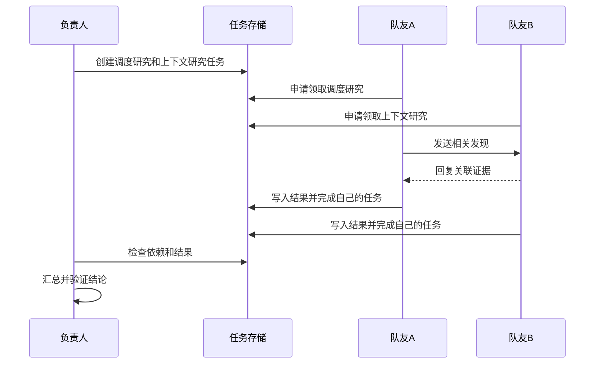

# 第一课：把 Agent Teams 看成一个协作运行时

本课约 45–60 分钟。目标是建立工程模型；TS 类型为教学设计，并非 Claude Code 源码，也不是可直接运行的完整框架。

## 从熟悉的单 Agent 出发

先使用一个简化模型：Agent 执行实例包含任务目标、上下文、可用工具和执行循环。模型提供下一步判断，运行时执行工具、保存状态并把结果交回循环。同一个模型可以支持多个不同的执行实例；角色名称也不等于进程隔离。

例如需要分析一个代码仓库：A 研究任务调度，B 研究上下文管理，C 汇总两人的证据。我们自己的教学系统要回答：怎样启动 A/B、各自看到什么、如何告知对方发现、C 何时能开始，以及 B 失败后如何处理。

Claude 的公开组件及版本边界见 [资料记录](../../../resources/agent-teams.md)。下面的字段和机制是用于学习的设计选择。

## 两类决策

| 决策 | 由什么承担 |
| --- | --- |
| 如何拆解问题、需要什么角色、证据是否充分 | 可以由模型辅助判断 |
| 任务当前归谁、是否允许转换状态、消息送给谁、如何限制执行 | 运行时代码执行明确规则 |

模型可以提议“领取任务”，运行时检查并落实。这个边界能把不确定的判断和需要一致性的状态操作分开。

## TypeScript 建模起点

```ts
type TaskState = 'pending' | 'running' | 'completed' | 'failed';

interface TeamTask {
  id: string;
  goal: string;
  state: TaskState;
  ownerId?: string;
  dependsOn: string[];
  resultRef?: string;
}

interface TeamMessage {
  id: string;
  from: string;
  to: string;
  taskId?: string;
  kind: 'finding' | 'question' | 'result';
  content: string;
}

interface AgentContext {
  agentId: string;
  goal: string;
  messages: TeamMessage[];
}
```

`TeamTask` 描述可追踪的工作及状态；`TeamMessage` 描述一次信息传递；`AgentContext` 是提供给某个执行实例的信息。消息到达后如何进入模型上下文，是另一个需要明确设计的步骤。共享任务存储并不会自动让全部聊天进入每个模型请求。

这个类型定义尚未禁止所有非法状态组合，也没有实现原子领取、持久化或消息投递；下一课会通过实际失败案例完善它。

## 一次协作过程



该图是教学流程示意，不声明 Claude 内部采用这些接口、存储或严格顺序。

## 用 Java 经验理解

可以把任务状态管理类比成后端任务系统，把邮箱类比成消息传递，把 AgentContext 类比成每次模型调用要组装的请求数据。但不能直接把 Agent 等同于线程：宿主可以采用同进程异步执行、子进程或远程服务。

并行是否值得，取决于可独立工作的比例、信息交换次数和整合成本。先为具体场景估算收益，再比较真实结果；增加角色数量本身不是质量证据。

## 学习检查

接下来回答 [三道检查题](../../../assessments/2026-09-11-agent-teams-01.md)。当前状态为待作答，尚未判定掌握。
